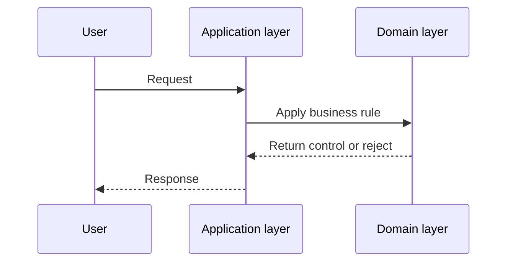

Consider an illustrative requirement for a restaurant ordering system: promotional discounts cannot exceed 50%.

Where does that check go?

In a small web application, the easiest place to put that check is wherever the HTTP request lands. You write an `if` statement in an Express route handler or a Next.js server action.

That placement works until another part of the system needs to update an order. A batch script, a seed script, or an administrative task might import the database model directly. If the 50% limit lives only in the HTTP route handler, any caller that bypasses that route can assign an invalid 75% discount.

The issue is not that the validation was written incorrectly. The check was placed in the wrong layer.

Architectural patterns address this by separating business rules from request coordination. In patterns cataloged by Martin Fowler and detailed in Microsoft's architecture guides, two common homes for logic are the domain model and the application layer.

Understanding the boundary helps callers that use the domain model apply the same business rule.

## Project Structure

To see how these layers interact in plain JavaScript, consider this file layout:

```text
project/
├── package.json
└── src/
    ├── domain/
    │   └── order.js
    ├── application/
    │   ├── apply-order-discount.js
    │   └── demo.js
    └── infrastructure/
        └── in-memory-order-repository.js
```

The domain directory holds core entities and business rules. The application directory coordinates a use case; the infrastructure directory provides the in-memory repository used by this example.

## The Domain Model: Business Rules and Invariants

As [Martin Fowler defines](https://martinfowler.com/eaaCatalog/domainModel.html), a domain model is an object model of the domain that incorporates both behavior and data.

In Domain-Driven Design (DDD), domain entities are not passive data bags. They protect their own consistency by enforcing invariants. An invariant is a condition that must always remain true for an entity to remain valid. As explained in Microsoft Learn's guide on [microservice domain models](https://learn.microsoft.com/en-us/dotnet/architecture/microservices/microservice-ddd-cqrs-patterns/microservice-domain-model) and [domain validations](https://learn.microsoft.com/en-us/dotnet/architecture/microservices/microservice-ddd-cqrs-patterns/domain-model-layer-validations), an entity should not be allowed to enter an invalid state in memory.

In our restaurant example, the 50% discount cap is a business policy. It is not a universal law of commerce, but within this restaurant's domain, an order with a 60% discount is invalid.

Here is the domain entity in `src/domain/order.js`:

```javascript
export class Order {
  #id;
  #discountPercent;

  constructor(id, discountPercent = 0) {
    this.#id = id;
    this.#discountPercent = 0;
    this.applyDiscount(discountPercent);
  }

  get id() {
    return this.#id;
  }

  get discountPercent() {
    return this.#discountPercent;
  }

  applyDiscount(percent) {
    if (typeof percent !== "number" || !Number.isFinite(percent)) {
      throw new TypeError("Discount percent must be a finite number");
    }
    if (percent < 0 || percent > 50) {
      throw new RangeError("Discount percent must be between 0 and 50");
    }
    this.#discountPercent = percent;
  }
}
```

Notice how this entity protects its data:

1. **Private state**: Using [MDN private class elements](https://developer.mozilla.org/en-US/docs/Web/JavaScript/Reference/Classes/Private_elements) (`#id` and `#discountPercent`), external code cannot mutate `order.discountPercent` directly.
2. **Finite and range validation**: The `applyDiscount` method verifies that the incoming value is a finite number between 0 and 50.
3. **Atomic state preservation**: If a caller passes an invalid value (such as `-5`, `75`, `NaN`, `Infinity`, or `"20"`), the method throws an error immediately. The prior valid discount remains unchanged.

This protection applies to any state changes made through `Order.applyDiscount`.

## The Application Layer: Use Cases and Coordination

If the entity enforces business rules, what does the application layer do?

Martin Fowler describes a [Service Layer](https://martinfowler.com/eaaCatalog/serviceLayer.html) as an application boundary that exposes operations and coordinates their responses.

While Fowler defines the general coordination role of a service layer, the specific architectural separation between domain behavior and application coordination is detailed in Microsoft Learn's guide on [DDD-oriented microservice layers](https://learn.microsoft.com/en-us/dotnet/architecture/microservices/microservice-ddd-cqrs-patterns/ddd-oriented-microservice). The application layer coordinates the workflow for a specific task: it accepts input, retrieves entities from storage, invokes domain methods, and saves changes.

Here is the application use case in `src/application/apply-order-discount.js`:

```javascript
export async function applyOrderDiscount(orderId, percent, orderRepository) {
  const order = await orderRepository.getById(orderId);
  if (!order) {
    return { success: false, error: "Order not found" };
  }

  order.applyDiscount(percent);

  await orderRepository.save(order);
  return { success: true, order };
}
```

To support local testing, here is a minimal repository in `src/infrastructure/in-memory-order-repository.js`:

```javascript
export class InMemoryOrderRepository {
  #orders = new Map();

  async getById(id) {
    return this.#orders.get(id) ?? null;
  }

  async save(order) {
    this.#orders.set(order.id, order);
  }
}
```

We can run the workflow directly in `src/application/demo.js`:

```javascript
import { Order } from "../domain/order.js";
import { applyOrderDiscount } from "./apply-order-discount.js";
import { InMemoryOrderRepository } from "../infrastructure/in-memory-order-repository.js";

const repository = new InMemoryOrderRepository();
await repository.save(new Order("order-101", 10));

const result = await applyOrderDiscount("order-101", 25, repository);
console.log(result.success, result.order.discountPercent);
```

This example uses native JavaScript modules. Set `"type": "module"` in `package.json`, save the files under `src/`, and run `node src/application/demo.js` from the project root. The output is `true 25`.

## The Request Lifecycle

Here is how the use case coordinates the operation:



Here `User` stands for the caller: the use case lets a domain error propagate, and the interface can map it into its response.

The application function also branches for ordinary workflow outcomes, without moving the business rule out of the domain:

- If the repository returns `null`, the use case exits early with a not-found result. It does not call `save()`.
- If the repository encounters a database error, that failure propagates to the caller.
- If `order.applyDiscount(percent)` throws because the discount exceeds 50%, execution halts before `repository.save()` is reached. This use case does not call save after domain rejection.

## Distinguishing Domain Logic from Application Logic

Developers new to layering often assume that every `if` statement belongs in the domain model.

Application code branches frequently: validating transport payloads, verifying authentication tokens, handling missing records, and formatting responses. None of these represent core business invariants.

Here is how to draw the boundary:

- **Interface and Application Boundaries**: Parsing HTTP request bodies, checking session tokens, running endpoint-level authorization guards, handling missing records, and managing repository persistence.
- **Domain Model**: Business calculations, state transitions, and business eligibility policies.

Consider a business eligibility rule: "Inactive customers cannot place an order."

A use case might fetch the `Customer` record from a database. But evaluating whether an order can proceed given that customer's status is a business rule. That rule belongs in domain behavior (such as a method on the `Customer` or `Order` model), rather than hardcoded in an HTTP handler. Transport and session authorization checks belong at interface and application boundaries as appropriate, while business eligibility belongs in the domain.

## A Practical Rule of Thumb

When deciding where a new check belongs, use this mnemonic:

> The **domain model** decides whether a business state change is valid.
> The **application layer** directs the steps to carry out a user task.

Different architectural styles (such as Clean Architecture, Ports and Adapters, and Onion Architecture) use different terms, including Use Cases, Application Services, or Interactors. Exact boundaries can shift when rules span multiple aggregates or external services. Treat this distinction as a practical guide rather than an absolute dogma.

To keep the focus on layering concepts, this example validates and stores a discount percentage; it does not calculate a discounted monetary total. Callers that change the discount through `Order.applyDiscount` follow the same 50% rule.
