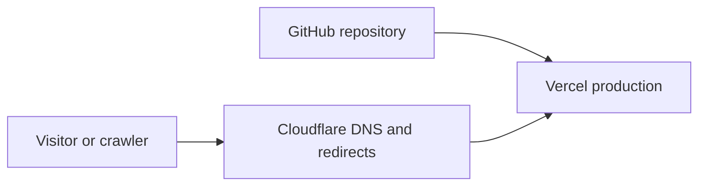
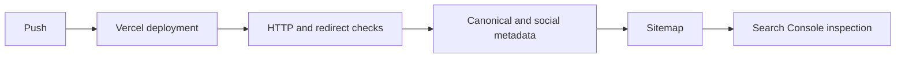

Moving a production portfolio and technical blog between hosting platforms sounds straightforward until search engines and edge networks get involved. A static export has no runtime server to catch missing headers, rewrite headers dynamically, or correct redirect chains on the fly. Every route, asset, canonical tag, and sitemap entry has to be right at build time.

During the September 2026 migration of `islamkamel.com` from GitHub Pages to Vercel behind Cloudflare, the focus was on preventing avoidable SEO drift: eliminating broken canonicals, unnecessary redirect hops, conflicting analytics containers, and ungrounded sitemap signals.

Here is the breakdown of the operational issues encountered, how each was resolved, and how static verification prevents regressions.

## Architecture and Edge Routing

The deployment pipeline is built around Next.js static exports (`output: "export"`). GitHub acts as the single source of truth; pushes to `main` trigger a Vercel production build that emits pre-rendered HTML, client chunks, and Open Graph card images into an export artifact. Cloudflare sits in front of Vercel to handle DNS management, edge caching, and domain-level redirects.



When verifying the initial migration, an inspection of the edge response headers revealed an inefficient two-hop redirect chain for requests originating on HTTP WWW:

1. `http://www.islamkamel.com/` returned an HTTP 301 redirecting to `https://www.islamkamel.com/`.
2. `https://www.islamkamel.com/` then returned another HTTP 301 redirecting to the canonical apex `https://islamkamel.com/`.

While human users in a modern browser rarely notice an extra TLS handshake, extra hops add latency and make canonical routing less direct for crawlers. We replaced the sequential rules with a single Cloudflare redirect rule matching both HTTP and HTTPS variations of the `www` hostname, forwarding requests directly to `https://islamkamel.com` in a single 301 response.

## Eliminating Measurement Drift in Analytics

During the migration audit, a subtle discrepancy surfaced in Google Tag Manager integration within `app/layout.tsx`.

The main client-side script had been updated to load the active container:

```tsx
<GoogleTagManager gtmId="GTM-NPFLTNVW" />
```

However, the manual `<noscript>` fallback iframe located immediately above it was still embedding the retired container ID from the earlier GitHub Pages deployment:

```html
<!-- Retired container from GitHub Pages -->
<iframe
  src="https://www.googletagmanager.com/ns.html?id=GTM-T3GSTK22"
  height="0"
  width="0"
  style="display:none;visibility:hidden"
/>
```

For visitors with JavaScript enabled, the modern script executed normally. But when JavaScript was disabled, the fallback iframe loaded a different retired GitHub Pages container, creating an inconsistent configuration. Correcting the noscript iframe source to `GTM-NPFLTNVW` resolved the discrepancy and aligned both tags to the active container.

## Truthful Sitemap Timestamps vs Deploy Timestamps

A common anti-pattern in static site generation is populating `lastModified` in `sitemap.ts` with `new Date()` for every URL:

```typescript
// Anti-pattern: Every deployment marks all pages as freshly modified
return [
  { url: siteConfig.url, lastModified: new Date() },
  { url: `${siteConfig.url}/blog`, lastModified: new Date() },
  ...blogEntries,
];
```

When every build stamps the current timestamp onto the homepage and category indices, search engine crawlers conclude that every page on the site changed, even when a commit only touched a CI configuration file or updated a typo in a single article. Crawlers rapidly learn to discount ungrounded `lastmod` headers.

To provide truthful indexing signals:
1. The homepage entry omits `lastModified` entirely, because there is no single factual modification date for the landing page without tracking content changes.
2. The `/blog` index derives its `lastModified` directly from the maximum `dateModified || date` across all published posts:

```typescript
const blogLastModified = posts.reduce(
  (latest, post) =>
    Math.max(latest, new Date(post.dateModified || post.date).getTime()),
  0
);
```

3. Each individual blog post retains its own authored and modified dates. The sitemap now accurately reflects real editorial updates.

## The Legacy Domain Decision

Before decommissioning the GitHub Pages setup, we examined Google Search Console for the previous `islam-kamel.github.io` property.

The data was conclusive: Search Console reported zero indexed pages on the old domain, and exactly one excluded URL classified as `Page with redirect`. Requests to `https://islam-kamel.github.io/` returned an HTTP 404.

This raised a strategic choice: should we maintain a legacy GitHub Pages deployment solely to serve 301 redirects, or leave the dormant domain alone?

Because Search Console showed no legacy URLs indexed or accumulating search impressions, maintaining an auxiliary repository branch or CNAME setup would create operational overhead with no SEO dividend. We opted against any legacy GitHub Pages redirect deployment, as there was no known indexed legacy URL to preserve.

## Automated Export Verification

Catching SEO defects after deployment is expensive. Because Next.js emits static files during `next build`, we enforce a verification loop that inspects the pre-rendered artifacts in `out/` before anything reaches production.



Using Node standard library assertions, a dedicated `scripts/verify-export.mjs` script validates the exported HTML:
- **Canonical Consistency:** Ensures `<link rel="canonical">` points to the exact route URL rather than inheriting the site root.
- **Social Tags:** Verifies Open Graph and Twitter cards match the post title, description, and dynamic 1200x630 card image URL.
- **Structured Data:** Validates schema.org `BlogPosting` JSON-LD with correct publication timestamps and author metadata.
- **Diagram Containers:** Confirms two Mermaid containers are emitted for the existing client renderer.
- **Robots and Sitemap:** Validates that `robots.txt` references `sitemap.xml`, and that sitemap entries contain accurate `lastmod` timestamps.
- **Tag Manager Parity:** Verifies that executable script/preload and noscript fallback tags use the active container `GTM-NPFLTNVW` without referencing the retired `GTM-T3GSTK22`.

Once deployed and validated on Vercel, the new article URL is submitted through the Google Search Console URL Inspection tool. While the inspection tool runs a real-time live test of the page markup, actual indexing remains an asynchronous process subject to search engine crawling queues. Combining edge correctness, truthful metadata, and automated static export testing ensures the migration stands on solid engineering ground.
