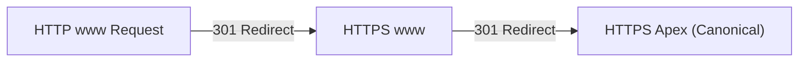
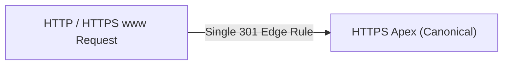

A static export has no runtime server to catch missing headers, rewrite responses dynamically, or resolve redirect chains on the fly. Every route, asset, canonical tag, and sitemap entry must be generated correctly at build time.

During the September 2026 migration of `islamkamel.com` from GitHub Pages to Vercel behind Cloudflare, the primary constraint was preventing SEO drift: eliminating broken canonicals, unnecessary redirect hops, conflicting analytics containers, and ungrounded sitemap signals.

## Edge Routing and Redirect Consolidation

The deployment pipeline is built around Next.js static exports (`output: "export"`). Pushes to `main` trigger a Vercel production build that emits pre-rendered HTML, client chunks, and Open Graph card images into an export artifact. Cloudflare manages DNS resolution, edge caching, and domain redirects.

Inspecting edge response headers revealed an inefficient two-hop redirect chain for requests originating on HTTP `www`:

1. `http://www.islamkamel.com/` returned an HTTP 301 redirecting to `https://www.islamkamel.com/`.
2. `https://www.islamkamel.com/` returned a second HTTP 301 redirecting to canonical apex `https://islamkamel.com/`.



While browsers follow sequential redirects transparently, each additional hop introduces round-trip latency and slows crawler discovery. Consolidating the routing rules in Cloudflare reduced this to a single edge redirect rule matching both HTTP and HTTPS requests on `www` and forwarding immediately to the apex domain:



## Removing the Retired GTM Container

During the migration audit, an inspection of `app/layout.tsx` identified conflicting Google Tag Manager container IDs between script and noscript elements.

The main client-side script had been updated to load the active container:

```tsx
<GoogleTagManager gtmId="GTM-NPFLTNVW" />
```

However, the manual `<noscript>` fallback iframe located immediately above it was still embedding the retired container ID from the earlier GitHub Pages deployment:

```html
<!-- Retired container from GitHub Pages -->
<iframe
  src="https://www.googletagmanager.com/ns.html?id=GTM-T3GSTK22"
  height="0"
  width="0"
  style="display:none;visibility:hidden"
/>
```

For visitors with JavaScript enabled, the client script executed normally. When JavaScript was disabled, the fallback iframe loaded the retired GitHub Pages container. Updating the noscript iframe source to `GTM-NPFLTNVW` aligned both tags to the active container.

## Deriving Factual Sitemap Modification Dates

A common anti-pattern in static site generation is populating `lastModified` in `sitemap.ts` with `new Date()` for every URL:

```typescript
// Anti-pattern: Every deployment marks all pages as freshly modified
return [
  { url: siteConfig.url, lastModified: new Date() },
  { url: `${siteConfig.url}/blog`, lastModified: new Date() },
  ...blogEntries,
];
```

When every build stamps the current timestamp onto the homepage and category indices, crawlers observe modification timestamps changing on every commit, including commits that only touch CI configurations or minor dependencies. Search engines discount ungrounded `lastmod` headers over time.

To produce truthful indexing signals:
1. The homepage entry omits `lastModified` entirely, because there is no single modification date for the landing page without tracking arbitrary build dates.
2. The `/blog` index derives its `lastModified` from the maximum `dateModified || date` across all published posts:

```typescript
const blogLastModified = posts.reduce(
  (latest, post) =>
    Math.max(latest, new Date(post.dateModified || post.date).getTime()),
  0
);
```

3. Each blog post entry retains its authored and edited dates. The sitemap reflects actual editorial changes rather than deploy timestamps.

## Evaluating Legacy Domain Redirects

Before decommissioning the GitHub Pages setup, Google Search Console records for the previous `islam-kamel.github.io` property were reviewed.

Search Console reported zero indexed pages on the old domain, and exactly one excluded URL classified as `Page with redirect`. Requests to `https://islam-kamel.github.io/` returned HTTP 404.

Because Search Console showed no legacy URLs indexed or receiving search impressions, maintaining an auxiliary repository branch or CNAME setup would add maintenance overhead without preserving organic traffic. The legacy GitHub Pages host was retired without auxiliary redirect infrastructure.

## Automated Static Export Verification

Catching SEO defects after deployment is expensive. Because Next.js emits static files during `next build`, a verification script inspects pre-rendered artifacts in `out/` before deployment:

- **Canonical Consistency:** Ensures `<link rel="canonical">` points to the exact route URL rather than inheriting the site root.
- **Social Tags:** Verifies Open Graph and Twitter cards match the post title, description, and dynamic 1200x630 card image URL.
- **Structured Data:** Validates schema.org `BlogPosting` JSON-LD with correct publication timestamps and author metadata.
- **Diagram Containers:** Confirms Mermaid containers are emitted for the client renderer.
- **Robots and Sitemap:** Validates that `robots.txt` references `sitemap.xml`, and that sitemap entries contain accurate `lastmod` timestamps.
- **Tag Manager Parity:** Verifies that executable script/preload and noscript fallback tags use the active container `GTM-NPFLTNVW` without referencing the retired `GTM-T3GSTK22`.

Once deployed on Vercel, the new article URL was submitted through the Google Search Console URL Inspection tool. While the inspection tool tests current page markup in real time, actual indexing remains an asynchronous process subject to search engine crawling schedules.
