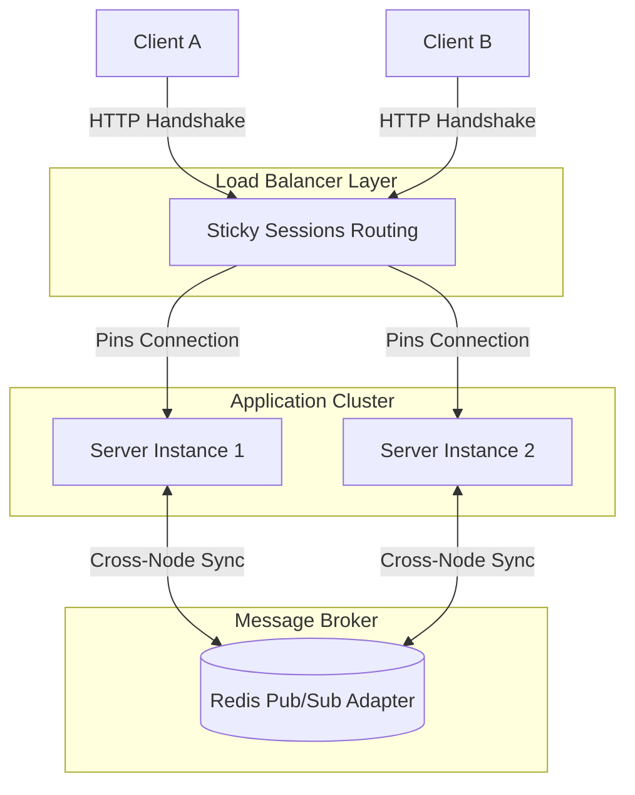

## The problem with polling

I had a telemetry dashboard that polled a `/status` endpoint every 2 seconds. For a single user it was fine. Once 30 operators had it open during a deployment, the backend was handling **900 requests per minute** just for status checks. Most responses were identical to the previous one.

The symptoms were predictable: increased latency on the actual API routes, pointless database reads, and a frontend that always felt slightly behind.

## What WebSockets actually changed

Switching to WebSockets meant the server pushes state changes only when they happen. No more redundant reads. The connection stays open, and the server decides when to send data.

Here is a minimal `socket.io` setup that replaced the polling loop:

```typescript
// server.ts
import { Server } from "socket.io";

const io = new Server(httpServer, {
  cors: { origin: process.env.CLIENT_URL },
});

io.on("connection", (socket) => {
  console.log(`Client connected: ${socket.id}`);

  // Send current state immediately on connect
  socket.emit("status", getCurrentStatus());

  // Push updates only when state changes
  const onStatusChange = (data: unknown) => {
    socket.emit("status", data);
  };

  statusEmitter.on("change", onStatusChange);

  socket.on("disconnect", () => {
    statusEmitter.off("change", onStatusChange);
    console.log(`Client disconnected: ${socket.id}`);
  });
});
```

On the client side, the React hook is straightforward:

```typescript
// useStatus.ts
import { useEffect, useState } from "react";
import { io } from "socket.io-client";

export function useStatus() {
  const [status, setStatus] = useState(null);

  useEffect(() => {
    const socket = io(process.env.NEXT_PUBLIC_WS_URL!);

    socket.on("status", setStatus);

    return () => {
      socket.disconnect();
    };
  }, []);

  return status;
}
```

## Tradeoffs I ran into

**Connection management is your problem now.** With REST, every request is independent. With WebSockets, you need to handle reconnection, backoff, and stale connections. `socket.io` handles most of this out of the box, but you still need to decide what happens when a client reconnects after being offline: does it get a full state snapshot or just a diff? I went with a full state snapshot on every reconnect. Diffing requires maintaining an in-memory event buffer with sequence numbers and eviction rules. Since our dashboard status payload was only a few kilobytes, sending `getCurrentStatus()` immediately on connect was simpler, stateless on the server, and guaranteed the client never drifted out of sync.

**Load balancers need sticky sessions.** If you are behind a round-robin load balancer, WebSocket upgrade requests can land on a different server than the one holding the connection. Sticky sessions (routing a client to the same server instance) and the Redis adapter (letting different server instances broadcast to each other's connected sockets) solve different problems, and in a multi-instance setup you typically need both together. I used Redis as a pub/sub adapter to share events across instances:

```typescript
import { createAdapter } from "@socket.io/redis-adapter";
import { createClient } from "redis";

const pubClient = createClient({ url: process.env.REDIS_URL });
const subClient = pubClient.duplicate();

await Promise.all([pubClient.connect(), subClient.connect()]);
io.adapter(createAdapter(pubClient, subClient));
```



**Not everything should be a WebSocket.** I kept one-off actions (triggering a deployment, updating a config) as regular REST calls. WebSockets are for continuous data flow, not for request-response patterns.

## Results

After the migration:

- Backend requests for status dropped by **~97%**
- Dashboard updates went from "up to 2 seconds stale" to sub-100ms
- CPU usage on the API server dropped noticeably during peak usage

The migration took about a week. Most of that time was spent on the reconnection logic and making sure the load balancer configuration was correct, not on the socket.io code itself.

## When polling is still fine

If your data changes once a minute and you have a handful of clients, polling is simpler and works. I would not recommend WebSockets for a settings page that refreshes occasionally. The overhead of maintaining persistent connections is only worth it when you have frequent updates and many concurrent consumers.
