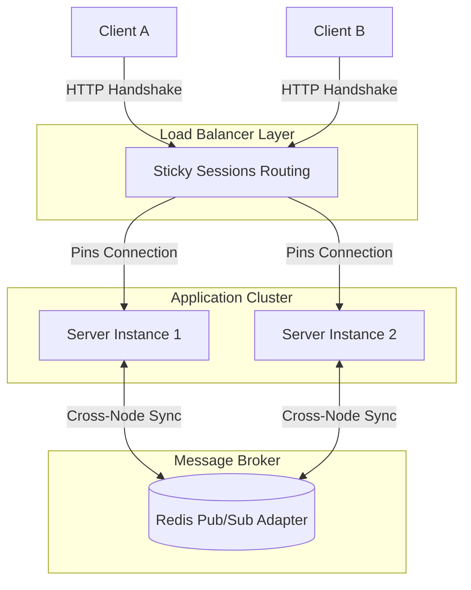

## The overhead of short polling

Short polling queries an HTTP endpoint on a fixed timer regardless of whether state has changed. For example, 30 active clients querying a `/status` endpoint every 2 seconds generate 900 requests per minute solely for status checks. When state changes infrequently, the majority of these responses return redundant payloads.

This pattern introduces predictable bottlenecks: unnecessary database reads, increased queue depth on API servers, and UI state that lags behind reality by up to the duration of the polling interval.

## Event-driven updates over persistent connections

Persistent WebSocket connections invert the communication model: clients maintain an open connection, and the server pushes events when mutations occur. This removes interval-based reads and avoids waiting for the next polling tick.

The following example illustrates a minimal event-driven setup using Socket.IO:

```typescript
// server.ts
import { Server } from "socket.io";

const io = new Server(httpServer, {
  cors: { origin: process.env.CLIENT_URL },
});

io.on("connection", (socket) => {
  console.log(`Client connected: ${socket.id}`);

  // Send current state immediately on connect
  socket.emit("status", getCurrentStatus());

  // Push updates only when state changes
  const onStatusChange = (data: unknown) => {
    socket.emit("status", data);
  };

  statusEmitter.on("change", onStatusChange);

  socket.on("disconnect", () => {
    statusEmitter.off("change", onStatusChange);
    console.log(`Client disconnected: ${socket.id}`);
  });
});
```

On the client side, the corresponding React hook manages connection lifecycle and cleanup:

```typescript
// useStatus.ts
import { useEffect, useState } from "react";
import { io } from "socket.io-client";

export function useStatus() {
  const [status, setStatus] = useState(null);

  useEffect(() => {
    const socket = io(process.env.NEXT_PUBLIC_WS_URL!);

    socket.on("status", setStatus);

    return () => {
      socket.disconnect();
    };
  }, []);

  return status;
}
```

## Architectural trade-offs

**Reconnect strategies: snapshot vs diff.** When a client reconnects after network interruption, it must re-synchronize state. Choosing between sending a full snapshot versus incremental event diffs depends on payload size and complexity:
- Event diffing requires an in-memory event buffer with monotonic sequence numbers and eviction policies.
- For compact state payloads, sending a full snapshot immediately on connection avoids a server-side event buffer and gives the client a defined synchronization baseline.

**Horizontal scaling and sticky sessions.** In multi-instance deployments behind a load balancer, WebSocket handshakes and persistent sockets require two coordination layers:
1. **Sticky sessions:** Route repeated HTTP transport upgrades from a given client to the specific node maintaining its connection.
2. **Pub/Sub message bus:** Broadcast state changes across all application nodes so any worker can notify its connected clients.

```typescript
import { createAdapter } from "@socket.io/redis-adapter";
import { createClient } from "redis";

const pubClient = createClient({ url: process.env.REDIS_URL });
const subClient = pubClient.duplicate();

await Promise.all([pubClient.connect(), subClient.connect()]);
io.adapter(createAdapter(pubClient, subClient));
```



**Separating commands from streams.** WebSockets are suited for continuous data streams and push notifications. Standard request-response operations—such as submitting forms, triggering mutations, or fetching static configurations—remain better suited to standard REST endpoints with conventional HTTP status codes and caching semantics.

## When polling remains the right choice

WebSockets introduce operational complexity: connection state tracking, heartbeat monitoring, connection drain during deployments, and horizontal synchronization. Short or long polling remains appropriate when:

- Data changes infrequently (e.g., once a minute or longer).
- The active client count is low, so request overhead does not strain database or server capacity.
- The interface does not require sub-second UI synchronization.

Persistent bidirectional connections are worth the operational overhead primarily when high client concurrency, rapid state mutations, or low-latency push notifications make polling inefficient.
