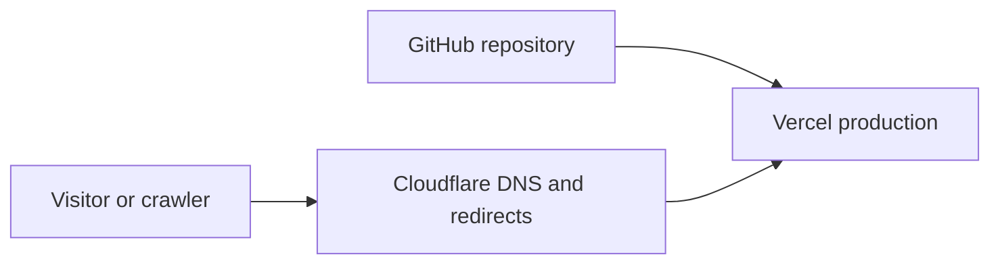
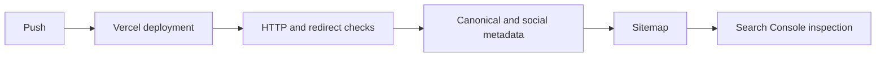

# DevOps Migration Article Implementation Plan

> **For agentic workers:** REQUIRED SUB-SKILL: Use superpowers:subagent-driven-development (recommended) or superpowers:executing-plans to implement this plan task-by-task. Steps use checkbox (`- [ ]`) syntax for tracking.

**Goal:** Publish a DevOps case study about the GitHub Pages to Vercel migration and correct the verified sitemap and Tag Manager defects without adding dependencies or another hosting path.

**Architecture:** Keep the existing static-export blog pipeline. Add one MDX file that automatically flows through the current metadata, JSON-LD, sitemap, Mermaid, and Open Graph image code, then make two narrow configuration corrections and add one Node export verifier.

**Tech Stack:** Next.js 15 App Router, TypeScript, MDX, Mermaid 11, Node.js standard library, Vercel static deployment.

## Global Constraints

- Add no dependency, UI component, Cloudflare rule, or GitHub Pages deployment.
- Keep the manual Google Tag Manager `<noscript>` fallback and update only its retired container ID.
- Use the latest post modification date for `/blog`; omit homepage `lastModified` because no truthful source exists.
- Every article URL must own its canonical, Open Graph, Twitter, JSON-LD, and generated Open Graph image values.
- Use the existing Mermaid fenced-block renderer for exactly two diagrams.
- Do not invent performance metrics, indexing results, or incident facts.

---

### Task 1: Publish the migration case study

**Files:**
- Create: `content/blog/migrating-github-pages-to-vercel.mdx`

**Interfaces:**
- Consumes: `getAllPosts()`, `getPostBySlug()`, `renderMarkdown()`, and the existing `[slug]/opengraph-image.tsx` route.
- Produces: the slug `migrating-github-pages-to-vercel` with valid `title`, `date`, `description`, and `tags` front matter.

- [ ] **Step 1: Add accurate front matter**

```yaml
title: "Migrating GitHub Pages to Vercel Without SEO Drift"
date: "2026-09-12"
description: "A practical DevOps case study on moving a static site to Vercel behind Cloudflare while preserving HTTPS canonicals, redirects, analytics, and indexing signals."
tags: ["DevOps", "Vercel", "Cloudflare", "SEO"]
```

- [ ] **Step 2: Write the incident narrative**

Cover the deployment path, the observed two-hop `http://www` redirect, the one-hop correction, the retired and active Tag Manager containers, truthful sitemap dates, Vercel production verification, and Search Console's asynchronous indexing state. State that the old GitHub Pages property had zero indexed pages, so no legacy deployment was restored.

- [ ] **Step 3: Add the two existing-format diagrams**





- [ ] **Step 4: Build once to verify the new static route and Open Graph image are generated**

Run: `npm run build`

Expected: exit 0 with `/blog/migrating-github-pages-to-vercel` and its `opengraph-image.png` emitted under `out/`.

### Task 2: Correct measurement and sitemap signals

**Files:**
- Modify: `app/layout.tsx`
- Modify: `app/sitemap.ts`

**Interfaces:**
- Consumes: the active container `GTM-NPFLTNVW` and `getAllPosts()` post dates.
- Produces: one consistent Tag Manager ID and deterministic blog sitemap metadata.

- [ ] **Step 1: Change the `<noscript>` iframe URL to the active container**

```tsx
src="https://www.googletagmanager.com/ns.html?id=GTM-NPFLTNVW"
```

- [ ] **Step 2: Derive only the blog index modification date from published posts**

```ts
const blogLastModified = posts.reduce(
  (latest, post) =>
    Math.max(latest, new Date(post.dateModified || post.date).getTime()),
  0
);
```

Omit `lastModified` from the homepage entry. Set the `/blog` entry's `lastModified` only when `blogLastModified` is nonzero.

- [ ] **Step 3: Run the build again**

Run: `npm run build`

Expected: exit 0 and generated `out/sitemap.xml` contains stable dates.

### Task 3: Add the smallest export regression check

**Files:**
- Create: `scripts/verify-export.mjs`
- Modify: `package.json`

**Interfaces:**
- Consumes: generated files under `out/`.
- Produces: the `npm run test:export` command with process exit 1 on a missing invariant.

- [ ] **Step 1: Add a Node standard-library verifier**

Read the generated homepage, article HTML, sitemap, and robots files. Assert:

```js
assert(!homepage.includes("GTM-T3GSTK22"));
assert(homepage.includes("GTM-NPFLTNVW"));
assert(article.includes(`<link rel="canonical" href="${articleUrl}"`));
assert(article.includes(`<meta property="og:url" content="${articleUrl}"`));
assert(article.includes(`<meta name="twitter:title" content="${title}"`));
assert(article.includes(`${articleUrl}/opengraph-image.png`));
assert(article.includes('"@type":"BlogPosting"'));
assert(article.includes('class="mermaid'));
assert(sitemap.includes(`<loc>${articleUrl}</loc>`));
assert(robots.includes("Sitemap: https://islamkamel.com/sitemap.xml"));
```

Also count two Mermaid blocks and verify the generated article Open Graph PNG exists. Use only `node:assert/strict`, `node:fs`, and `node:path`.

- [ ] **Step 2: Expose the verifier**

```json
"test:export": "node scripts/verify-export.mjs"
```

- [ ] **Step 3: Run all local gates**

Run: `npm run lint`

Expected: exit 0. Inspect any auto-fixes before keeping them.

Run: `npm run build && npm run test:export`

Expected: both exit 0.

Run: `git diff --check`

Expected: no output.

### Task 4: Review, publish, and verify production

**Files:**
- Review only: all changed files from Tasks 1 through 3.

**Interfaces:**
- Consumes: a green local build and export check.
- Produces: a pushed commit, a successful Vercel production deployment, and a Search Console indexing request for the new article.

- [ ] **Step 1: Run the required delegated read-only review and native validation**

The review must check content accuracy, route-specific metadata, deterministic sitemap dates, Tag Manager consistency, and verifier coverage.

- [ ] **Step 2: Commit the reviewed changes**

```bash
git add app/layout.tsx app/sitemap.ts content/blog/migrating-github-pages-to-vercel.mdx scripts/verify-export.mjs package.json
git commit -m "feat: publish DevOps migration case study"
```

- [ ] **Step 3: Push `main` and verify Vercel**

Run: `git push origin main`

Expected: Vercel reports the new deployment as Production and Ready.

- [ ] **Step 4: Verify the live artifact**

Confirm the article returns 200, the WWW HTTP form redirects directly to the HTTPS apex form, the live head owns the correct canonical and social values, the sitemap lists the article, and the retired Tag Manager ID is absent.

- [ ] **Step 5: Request indexing**

Inspect `https://islamkamel.com/blog/migrating-github-pages-to-vercel` in the current Search Console property, run the live test, and request indexing. Record Google processing as asynchronous rather than claiming immediate indexing.
